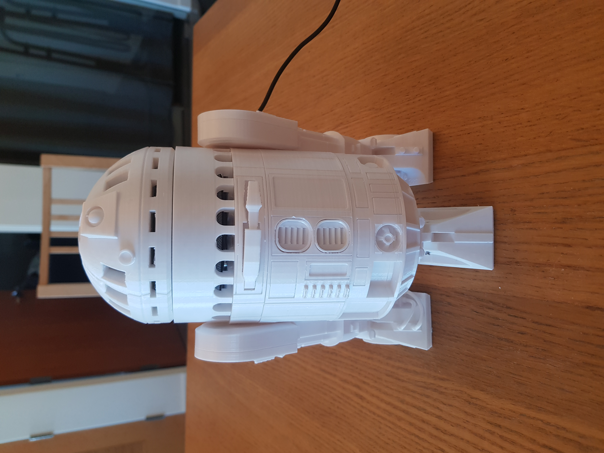
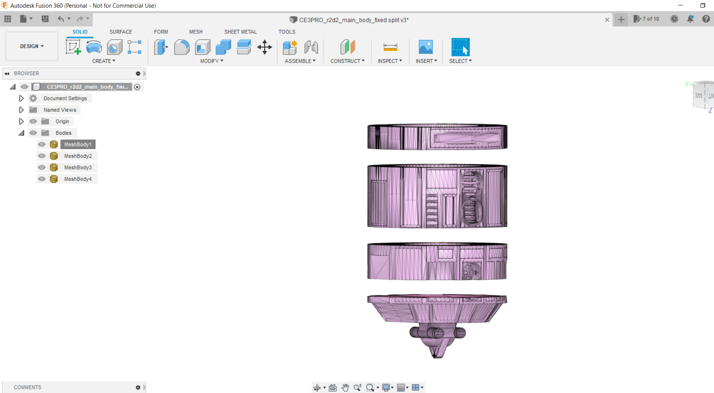
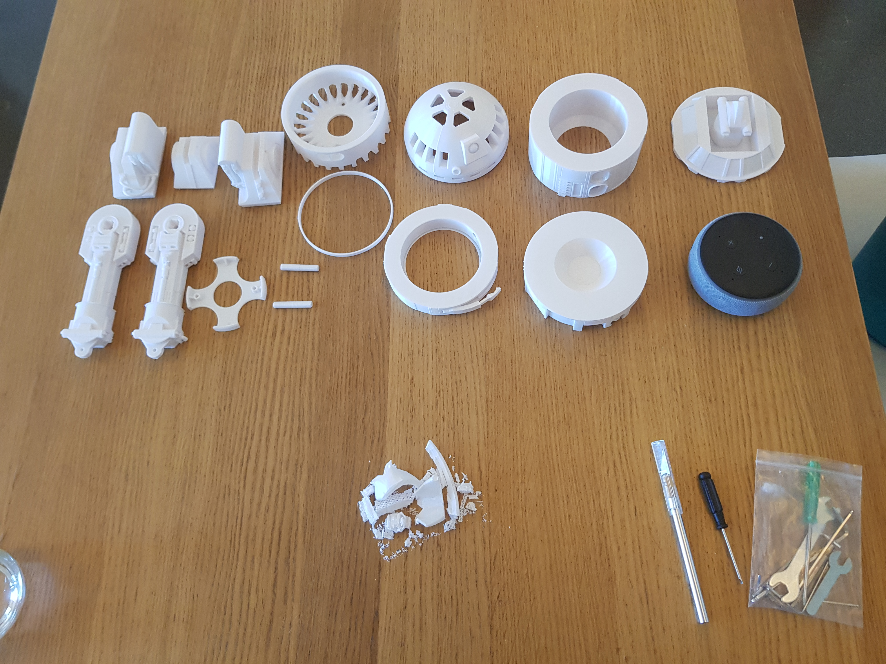
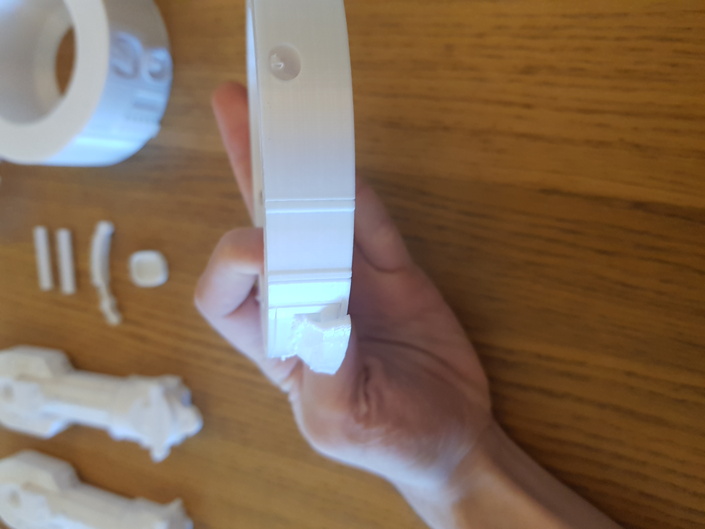
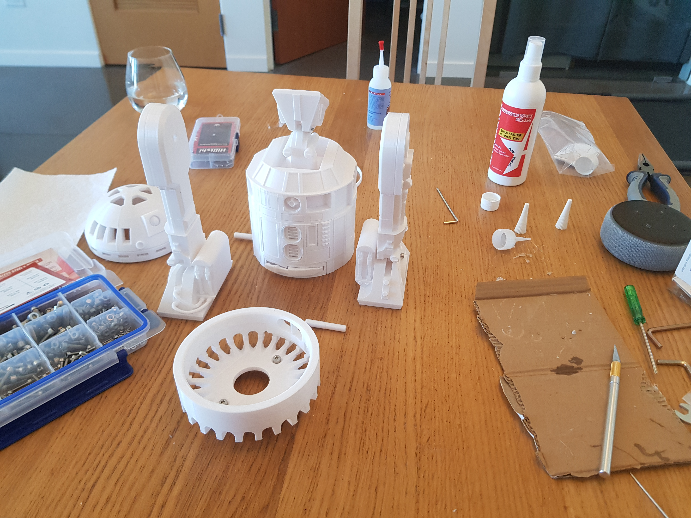
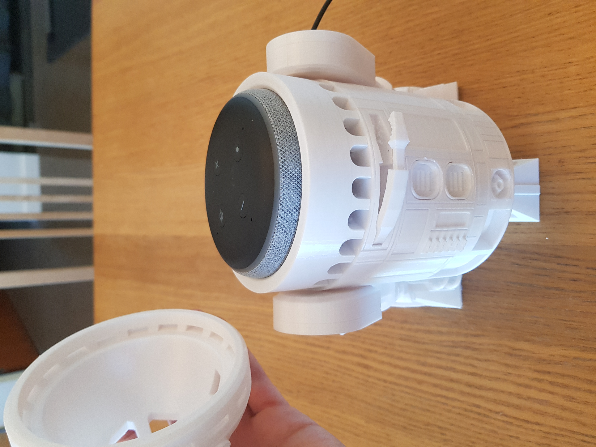

# r2d2_echo_stand
Documenting a Project to 3d Print an R2D2 sculpture with room for my Amazon echo dot Gen 3 inside. [Here](https://www.thingiverse.com/thing:4354796) is the model i used.     

Imported into Fusion 360. Realized they import in CM so scaled down model by 1/10. Did planar cuts with fill minimal. Printed these out.

This link showed me that importing is in CM by default: https://forums.autodesk.com/t5/fusion-360-design-validate/why-are-fusion-dimensions-10x-greater-on-imported-stl-files/td-p/5439722     

And here is a helpful resource on cutting 3d models in fusion 360 to print: https://www.youtube.com/watch?v=KFQ4-1GH0wg     

I included the STL files for the split body in the repo.     

Printed slowly over a couple weeks.

Used M2x20mm screw for middle foot and body,  2x M4x12mm and M4 Nutts for fixateur to alexa part, 2x M3x12mm for left leg to left foot and right leg to right foot.     

I learned that when splitting a large body, it works best to put in joints like dovetail joints so that you can easily glue it together. Dovetail joints or something like that would make it easy to line up the body pieces when glueing, while also giving more strength due to more surface area to glue. In particular, I had a tough time lining up my body pieces when glueing.

### Laying it all out
    

### Removing supports
     

### Assembling
    

### Showing it Off
    

